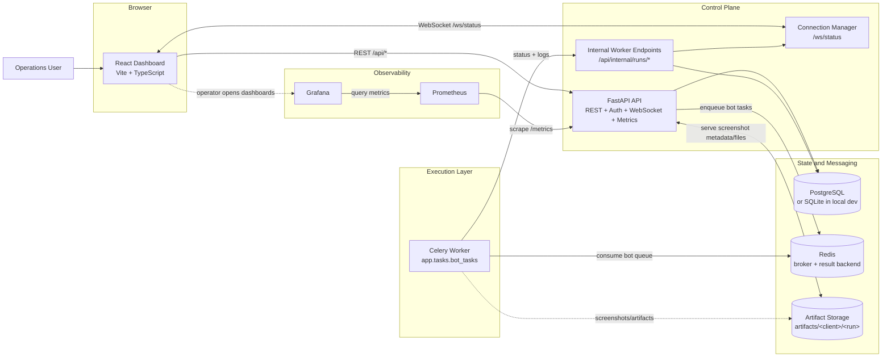
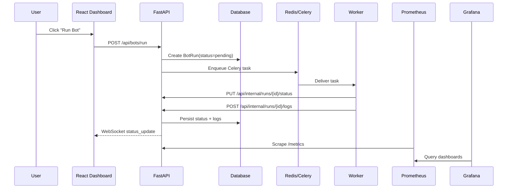

# Architecture Diagram

This document reflects the current runtime architecture in the repository as of April 12, 2026.

## System Architecture

## Key Boundaries

- The frontend only talks to the backend API and WebSocket endpoint.
- Bot execution is asynchronous and runs in Celery workers, not inside FastAPI request handlers.
- Workers report status and logs back through internal API endpoints secured with an internal API key.
- Persistent state lives in the database; Redis is used for queueing and task coordination.
- Prometheus scrapes the FastAPI app, and Grafana reads from Prometheus rather than from the application database.

## Run Lifecycle

