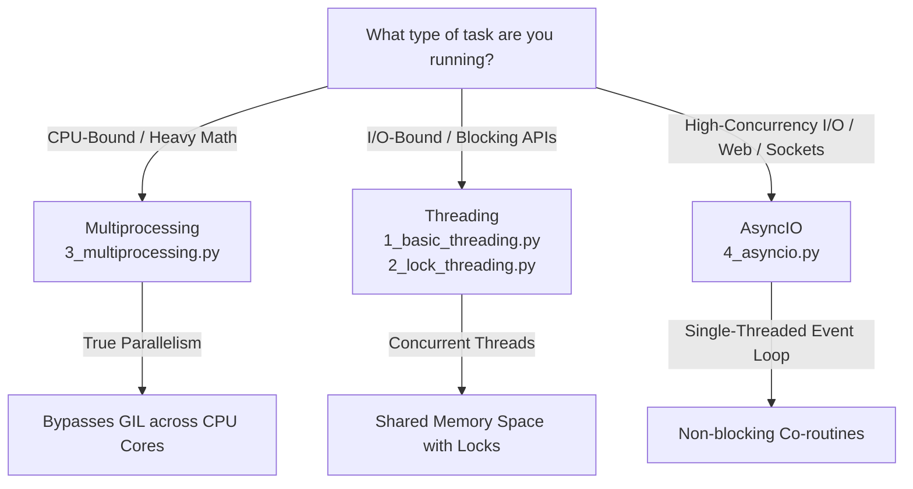

# ⚙️ Python Concurrency & Parallelism: Multi-Threading, Multiprocessing & AsyncIO

> **Category:** Concurrency Models & Asynchronous I/O  
> **Frameworks:** Python Standard Library (`threading`, `multiprocessing`, `asyncio`)  
> **Execution Engine:** Python 3.12+ (managed by `uv`)  

---

## 1. Overview

Python offers three primary paradigms for concurrent and parallel program execution. Each model addresses distinct workload characteristics:



---

## 2. Concurrency Paradigms Matrix

| Dimension | `threading` | `multiprocessing` | `asyncio` |
|:---|:---|:---|:---|
| **Mechanism** | OS Preemptive Threads | Separate OS Processes | Cooperative Event Loop |
| **Memory Space** | **Shared** across threads | **Isolated** per process | **Shared** within single process |
| **GIL Impact** | Subject to GIL (1 active thread for bytecode) | **Bypasses GIL** completely | Runs on single thread |
| **Best For** | I/O-bound tasks, GUI responsiveness, background worker threads | CPU-bound math, image processing, machine learning simulation | Massive I/O concurrency, web servers, microservices, chat sockets |
| **IPC Overhead** | Minimal (shared variables; requires locks) | High (pickling, pipes, queues) | Negligible (in-memory async tasks) |
| **Primary Risk** | Race conditions, deadlocks | Memory consumption, inter-process communication serialization | Starvation if blocking synchronous code is awaited |

---

## 3. Included Demonstration Modules

### 1. Basic Threading (`1_basic_threading.py`)
- Demonstrates thread lifecycle: subclassing `threading.Thread`, starting with `.start()`, and waiting with `.join()`.
- Thread naming and structured logging output.
- Configurable delay intervals.

### 2. Lock Synchronization (`2_lock_threading.py`)
- Demonstrates mutual exclusion using `threading.Lock`.
- Uses `with lock:` context manager to guarantee automatic lock release even in error paths.
- Compares coarse-grained vs. fine-grained synchronization.

#### Analogy Guide: Locks, Semaphores & Condition Variables
- **Lock Object:** A single key for a private restroom — only one thread can enter at any given moment.
- **Semaphore:** A locker room with $N$ available lockers — multiple threads can proceed concurrently as long as counter $> 0$.
- **Condition Variable:** A waiting lounge with a notification buzzer — threads wait for a specific condition change before waking up to acquire a lock.

### 3. Multiprocessing (`3_multiprocessing.py`)
- Spawns independent operating system processes with separate memory spaces using `multiprocessing.Process`.
- Demonstrates multi-core utilization bypassing the Python Global Interpreter Lock (GIL).
- Enforces `if __name__ == "__main__":` guard for cross-platform process spawning safety.

### 4. Asynchronous I/O (`4_asyncio.py`)
- Demonstrates single-threaded cooperative multitasking using `async`/`await` and `asyncio.sleep()`.
- Executes concurrent coroutines using `asyncio.gather()`.
- Shows how total execution time equals the max task duration rather than the sum of all tasks.

---

## 4. Running the Examples

Run any module using `uv`:

```bash
# Basic Threading
uv run python multi_threading/1_basic_threading.py

# Thread Locking
uv run python multi_threading/2_lock_threading.py

# Multiprocessing
uv run python multi_threading/3_multiprocessing.py

# AsyncIO Event Loop
uv run python multi_threading/4_asyncio.py
```

### Running Automated Test Suite

```bash
uv run pytest tests/test_multi_threading.py
```
