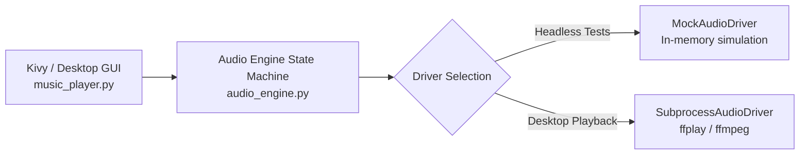

# 🎵 Python Desktop Music Player

> **Category:** Desktop GUI & Multimedia Player  
> **Framework:** Kivy / Tkinter Fallback  
> **Architecture:** Decoupled Playback State Machine (`audio_engine.py`) + Event GUI (`music_player.py`)  
> **Audio Driver:** Subprocess (`ffplay` / `ffmpeg`) with Headless Mock Support  
> **Package Management:** `uv`  

---

## 1. Overview & Architecture

A cross-platform desktop audio player built with a decoupled software architecture. The business logic (queue management, volume attenuation, progress calculation, format filtering) is isolated in `audio_engine.py` using the **Strategy Pattern** for audio drivers.



### Key Features
- **Decoupled State Machine:** Full playback lifecycle management (`PLAYING`, `PAUSED`, `STOPPED`) independent of any graphical toolkit.
- **Pluggable Audio Drivers:**
  - `SubprocessAudioDriver`: Leverages system `ffplay` for low-latency playback of MP3, WAV, OGG, FLAC, and M4A.
  - `MockAudioDriver`: Enables 100% headless testing in CI/CD without audio hardware.
- **Playlist Management:** Format filtering, Next/Previous queue traversal, and automatic track progression upon completion.
- **Volume & Progress Synchronization:** Two-way synchronization between playback timers and GUI sliders.
- **Resilient Fallback:** Graceful command-line messaging if running in headless environments without display servers.

---

## 2. Directory Structure

```
music_player/
├── audio_engine.py    # Core playback state machine and driver abstractions
├── music_player.py    # Kivy graphical user interface
├── audio.mp3          # Default bundled sample audio track
└── README.md          # Project documentation
```

---

## 3. How to Run

### Interactive GUI Mode
Ensure `ffmpeg` is installed for audio decoding (`sudo apt install ffmpeg` on Linux, `brew install ffmpeg` on macOS):

```bash
# Launch player
uv run python music_player/music_player.py
```

### Automated Headless Tests
Run the automated test suite verifying playlist transitions, volume clamping, and duration tracking:

```bash
uv run pytest tests/test_music_player.py
```
