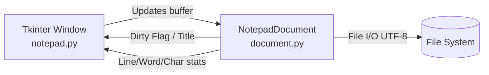

# 📝 Python Desktop Notepad

> **Category:** Desktop GUI & Text Processing  
> **Framework:** Python standard library (`tkinter`)  
> **Architecture:** Decoupled Document Buffer Model (`document.py`) + Event GUI (`notepad.py`)  
> **Package Management:** `uv`  

---

## 1. Overview & Architecture

A lightweight, feature-rich desktop text editor built with Python and Tkinter. The architecture strictly isolates document state, text buffers, file persistence, and metric calculations in `document.py` (`NotepadDocument`), separating them from visual presentation and enabling headless unit testing.



### Key Features
- **Decoupled Buffer Model:** Document statistics (character, word, and line count), cursor coordinate calculations, and undo/redo stacks operate headlessly.
- **File Management:** Create New, Open, Save, and Save As with UTF-8 encoding support.
- **Unsaved Changes Guard:** Prompts the user to save before discarding changes when creating a new file, opening another document, or closing the application.
- **Dirty State Title Indicator:** Automatically prepends an asterisk (`*`) to the window title when unsaved edits are present.
- **Status Bar Metrics:** Displays real-time cursor line and column position along with live word and character counts.
- **Keyboard Shortcuts:** Fast keyboard navigation for all standard editing commands.

---

## 2. Directory Structure

```
notepad/
├── document.py        # Decoupled document buffer model (NotepadDocument)
├── notepad.py         # Tkinter user interface, menus, shortcuts, and dialogs
└── README.md          # Project documentation
```

---

## 3. Keyboard Shortcuts

| Shortcut | Action |
|:---|:---|
| `Ctrl + N` | New Document |
| `Ctrl + O` | Open File |
| `Ctrl + S` | Save File |
| `Ctrl + Shift + S` | Save As |
| `Ctrl + Z` | Undo |
| `Ctrl + Y` | Redo |
| `Ctrl + X` | Cut |
| `Ctrl + C` | Copy |
| `Ctrl + V` | Paste |
| `Ctrl + A` | Select All |

---

## 4. How to Run

### Interactive GUI Mode
From the repository root using `uv`:

```bash
uv run python notepad/notepad.py
```

### Automated Headless Tests
Run the automated test suite verifying document model mutations, coordinate mapping, and file persistence:

```bash
uv run pytest tests/test_notepad.py
```
